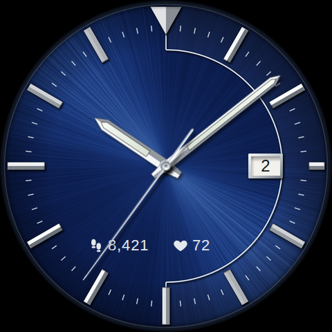
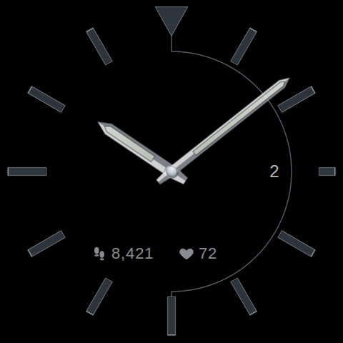

# Sunburst Navy watch face

A Wear OS watch face for the Samsung Galaxy Watch Ultra (480x480, Wear OS 5+), recreating a
blue-dial Kinetic 100M as closely as possible. No brand wordmarks are reproduced.

| Active | Always-on |
| --- | --- |
|  |  |

- Radially brushed navy sunburst dial, lit from the upper left
- Applied, faceted steel markers and 12 o'clock triangle with drop shadows
- Silver half-ring from 12 to 6, printed minute track, recessed date window at 3
- Pointed steel hands with framed lume; shadows fall consistently as the hands turn
- Quartz-style ticking seconds hand with a slight overshoot
- Two swappable readouts below centre (default: steps and heart rate)
- Always-on mode: black dial, outlined markers, dimmed hands, no seconds hand

Built with [Watch Face Format](https://developer.android.com/training/wearables/wff) v2
(resource-only, no code), the format Samsung requires for third-party faces on Wear OS 5+.

## Layout

| Path | What it is |
| --- | --- |
| `face.py` | Shared geometry and palette (measured from photos of the original). |
| `render_assets.py` | Renders the bitmaps: dial, always-on dial, hands, hand shadows, previews. |
| `generate.py` | Writes `app/src/main/res/raw/watchface.xml`, which places and animates the bitmaps. |
| `hand_layout.json` | Hand bitmap placement, written by `render_assets.py`, read by `generate.py`. |
| `app/` | Minimal Android app that packages the face. |

Workflow after changing artwork or geometry:

```sh
python3 render_assets.py   # needs numpy, Pillow, node + playwright (Chromium)
python3 generate.py
```

The PNGs are committed, so CI only re-runs `generate.py` and fails if the XML is stale.

## Getting the APK

The `watchface` GitHub Actions workflow validates the XML against Google's WFF v2 schema,
builds `app-release.apk`, and uploads it as the `sunburst-navy-watchface-apk` artifact.
Open **Actions → watchface → latest run → Artifacts** to download it.

To build locally with the Android SDK installed: `gradle assembleRelease` (Gradle 8.9+), or open
this folder in Android Studio.

## Installing on the watch (sideload)

1. On the watch, open **Settings → About watch → Software information** and tap
   **Software version** repeatedly until developer mode turns on.
2. In **Settings → Developer options**, turn on **ADB debugging** and **Wireless debugging**.
   The watch and the installing device must be on the same Wi-Fi network.
3. Under **Wireless debugging → Pair new device**, note the IP:port and pairing code, then:
   - From a computer: `adb pair IP:PORT CODE`, `adb connect IP:PORT` (the port shown on the
     main Wireless debugging screen), then `adb install app-release.apk`.
   - From an Android phone: use an ADB sideloading app that supports wireless pairing.
4. Long-press the current watch face, scroll to **Add watch face**, and pick **Sunburst Navy**.
   Long-press it and tap **Customize** to change the two readouts.
5. Turn ADB debugging off again when done.

Menu names vary slightly between One UI Watch versions.
