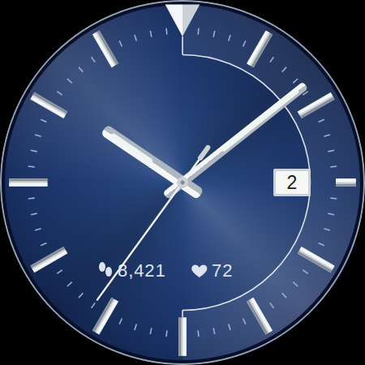

# Sunburst Navy watch face

A Wear OS watch face for the Samsung Galaxy Watch Ultra (or any round Wear OS 5+ watch),
modelled on a blue-dial Kinetic 100M dress/sport watch. No brand wordmarks are reproduced.

- Navy sunburst dial, polished faceted batons, inverted triangle at 12
- Silver half-ring from 12 to 6, minute track, white date window at 3
- Lumed baton hands; seconds hand ticks once per second
- Two swappable readouts below centre (default: steps and heart rate)
- Always-on mode: black dial, dimmed markers and readouts, no seconds hand

It is built with [Watch Face Format](https://developer.android.com/training/wearables/wff)
v2 (XML, no code), which Samsung requires for third-party faces on Wear OS 5 and later.

## Layout

| Path | What it is |
| --- | --- |
| `generate.py` | Source of truth. Colours and geometry live here. |
| `app/src/main/res/raw/watchface.xml` | Generated WFF definition. Do not hand-edit. |
| `preview/preview.html` | Generated browser mock-up used to render `preview.png`. |
| `app/` | Minimal resource-only Android app that packages the face. |

After editing `generate.py`, run `python3 generate.py`. CI fails if the generated files are stale.

## Getting the APK

The `watchface` GitHub Actions workflow validates the XML against Google's WFF v2 schema,
builds `app-release.apk`, and uploads it as the `sunburst-navy-watchface-apk` artifact.
Open **Actions → watchface → latest run → Artifacts** to download it.

To build locally with the Android SDK installed: `gradle assembleRelease` (Gradle 8.9+), or open
this folder in Android Studio.

## Installing on the watch (sideload)

1. On the watch, open **Settings → About watch → Software information** and tap
   **Software version** repeatedly until developer mode turns on.
2. In **Settings → Developer options**, turn on **ADB debugging** and **Wireless debugging**.
   The watch and the installing device must be on the same Wi-Fi network.
3. Under **Wireless debugging → Pair new device**, note the IP:port and pairing code, then:
   - From a computer: `adb pair IP:PORT CODE`, `adb connect IP:PORT` (the port shown on the
     main Wireless debugging screen), then `adb install app-release.apk`.
   - From an Android phone: use an ADB sideloading app that supports wireless pairing.
4. Long-press the current watch face, scroll to **Add watch face**, and pick **Sunburst Navy**.
   Long-press it and tap **Customise** to change the two readouts.
5. Turn ADB debugging off again when done.

Menu names vary slightly between One UI Watch versions.
